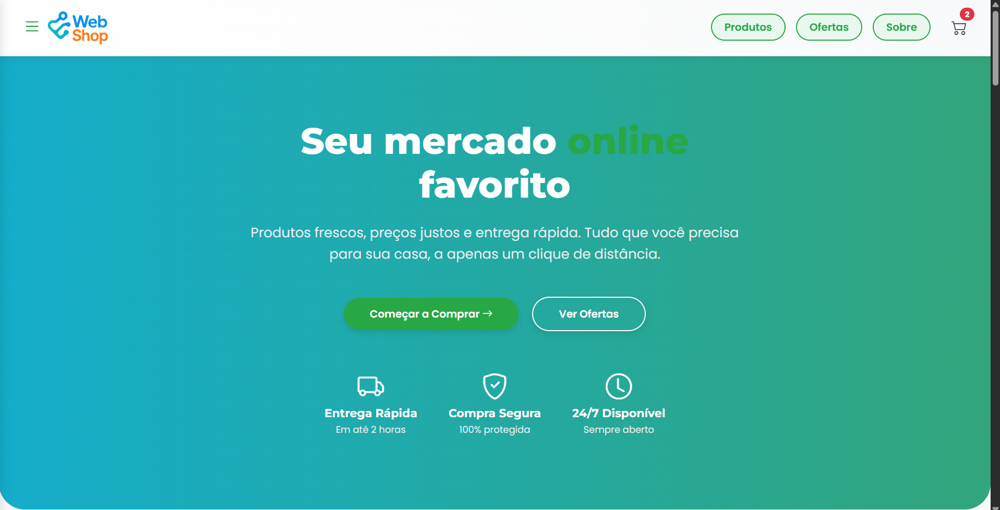
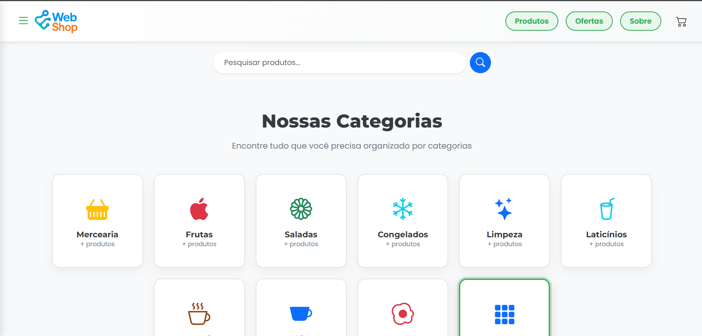
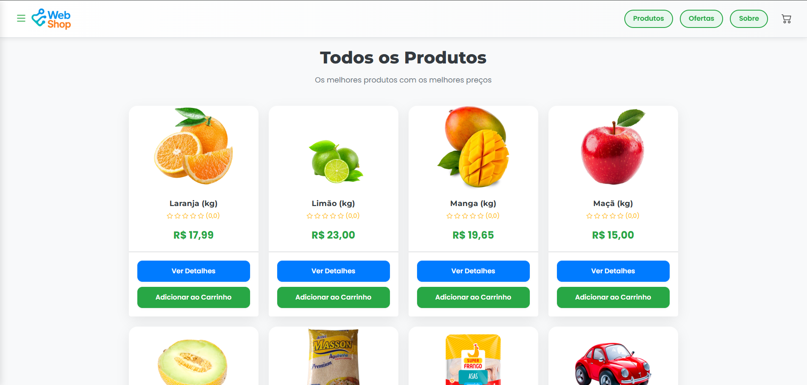
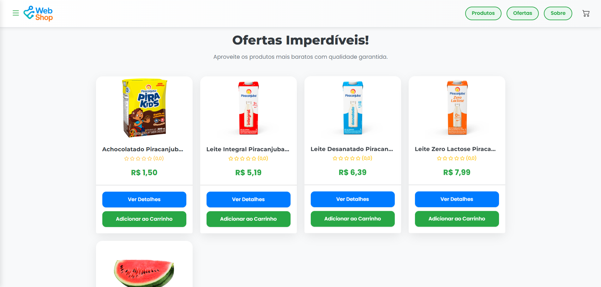
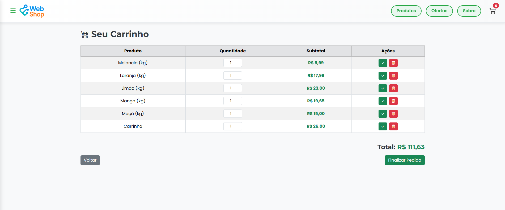
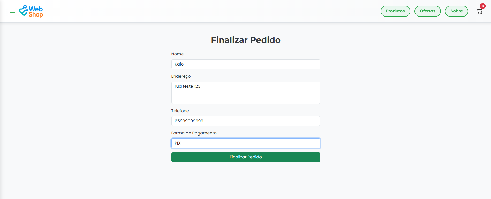
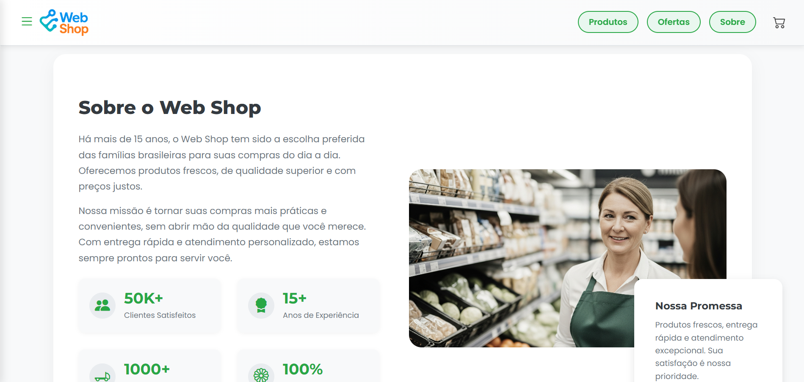
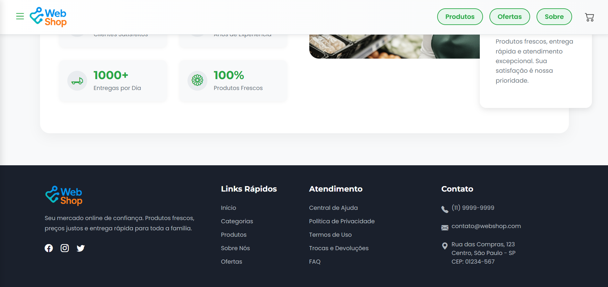

# Web Shop - Supermercado Online 🚒🧶

Bem-vindo ao repositório oficial do **Web Shop**, um site de supermercado online desenvolvido com Django. A plataforma permite que usuários explorem categorias de produtos, adicionem itens ao carrinho e realizem pedidos de forma prática e rápida.

## 🔗 Tabela de Conteúdos

* [Sobre o Projeto](#-sobre-o-projeto)
* [Principais Funcionalidades](#-principais-funcionalidades)
* [Tecnologias e Ferramentas](#%EF%B8%8F-tecnologias-e-ferramentas)
* [Ambiente de Desenvolvimento (Docker)](#-ambiente-de-desenvolvimento-docker)
* [Qualidade e Testes](#-qualidade-e-testes)
* [Como Contribuir](#-como-contribuir)
* [Capturas de Tela](#-capturas-de-tela)

## 💡 Sobre o Projeto

O **Web Shop** tem como objetivo oferecer uma solução completa para compras online de supermercado, com uma interface simples, moderna e acessível.

### Integração com o Sales_Hub

Este sistema é **totalmente integrado com o [Sales_Hub]**, um sistema de **gestão de estoque** também desenvolvido com Django. Através dessa integração, os produtos exibidos no Web Shop são sincronizados com o estoque gerenciado no Sales_Hub, garantindo consistência e atualização automática de quantidades disponíveis.

## 🔑 Principais Funcionalidades

* Página inicial com destaques e promoções
* Filtro de produtos por categoria
* Carrinho de compras com total dinâmico
* Envio de pedidos via WhatsApp
* Autenticação e autorização de usuários para gestão do site
* Layout responsivo para desktop e smartphones
* Painel administrativo para gerenciar produtos, categorias e marcas

## 🛠️ Tecnologias e Ferramentas

* **Backend:** Python 3.12, Django 5.x
* **Frontend:** HTML5, CSS3, Bootstrap 5
* **Banco de Dados:** PostgreSQL
* **Servidor de Aplicação:** Gunicorn
* **Containerização:** Docker & Docker Compose
* **Configuração:** `python-decouple` para gerenciar variáveis de ambiente.
* **Qualidade de Código:** Testes com cobertura de 100%, `pre-commit`, `Flake8` e `Coverage.py`.

## 🚀 Ambiente de Desenvolvimento (Docker)

O projeto é totalmente containerizado com Docker, garantindo um ambiente de desenvolvimento consistente e fácil de configurar.

### 1. Pré-requisitos

* [Git](https://git-scm.com/)
* [Docker](https://www.docker.com/products/docker-desktop/)
* [Docker Compose](https://docs.docker.com/compose/)

### 2. Clonar o Repositório

```bash
git clone https://github.com/KaioHerculano/web_shop.git
cd web_shop
```

### 3. Configuração do Ambiente

O projeto utiliza um arquivo .env para gerenciar as variáveis de ambiente.

```bash
cp .env.example .env
```

Abra o arquivo `.env` recém-criado e preencha as variáveis necessárias, como a `SECRET_KEY`.

### 4. Subir os Containers

Com o Docker em execução, construa as imagens e inicie os serviços:

```bash
docker-compose up -d --build
```

Este comando irá baixar a imagem do PostgreSQL, construir a imagem da sua aplicação Django e iniciar os dois containers em background.

### 5. Configuração Inicial do Banco de Dados

Com os containers rodando, execute as migrações e crie um superusuário para acessar o painel administrativo:

```bash
# Executar as migrações
docker-compose run --rm web python manage.py migrate

# Criar um superusuário
docker-compose run --rm web python manage.py createsuperuser
```

### 6. Acessar a Aplicação

Pronto! Sua aplicação está no ar.

* Site: [http://localhost:8000](http://localhost:8000)
* Admin: [http://localhost:8000/admin](http://localhost:8000/admin)

## ✅ Qualidade e Testes

O projeto segue um padrão rigoroso de qualidade, com o objetivo de manter 100% de cobertura de testes.

Para rodar a suíte de testes completa:

```bash
docker-compose run --rm web python manage.py test
```

Para gerar o relatório de cobertura (os resultados estarão na pasta `htmlcov`):

```bash
docker-compose run --rm web coverage run manage.py test
docker-compose run --rm web coverage html
```

## 🤝 Como Contribuir

Contribuições são muito bem-vindas!

1. Faça um "fork" do projeto.
2. Crie uma nova branch para sua funcionalidade (`git checkout -b feature/minha-feature`).
3. Faça o commit de suas alterações (`git commit -m 'feat: Adiciona minha feature'`).
4. Envie para a sua branch (`git push origin feature/minha-feature`).
5. Abra um Pull Request.

O projeto utiliza um template de Pull Request para garantir que as contribuições sejam claras e completas. Por favor, preencha as seções indicadas ao abrir seu PR.

## 📷 Capturas de Tela

### Topo da página


### Lista de Categorias


### Produtos


### Ofertas


### Carrinho de Compras


### Finalizar Pedido


### Sobre


### Rodapé

